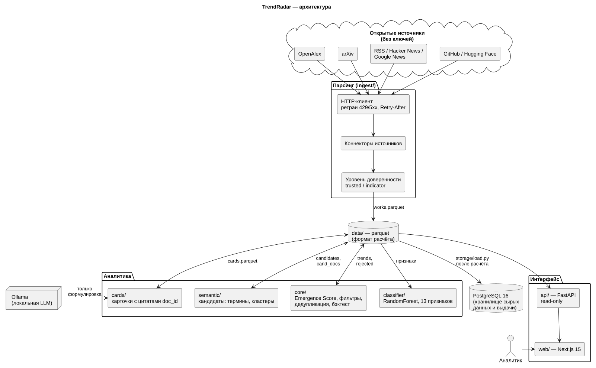
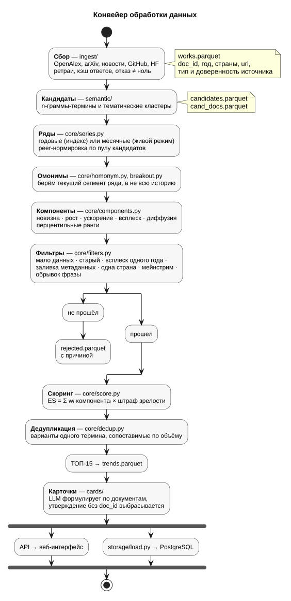
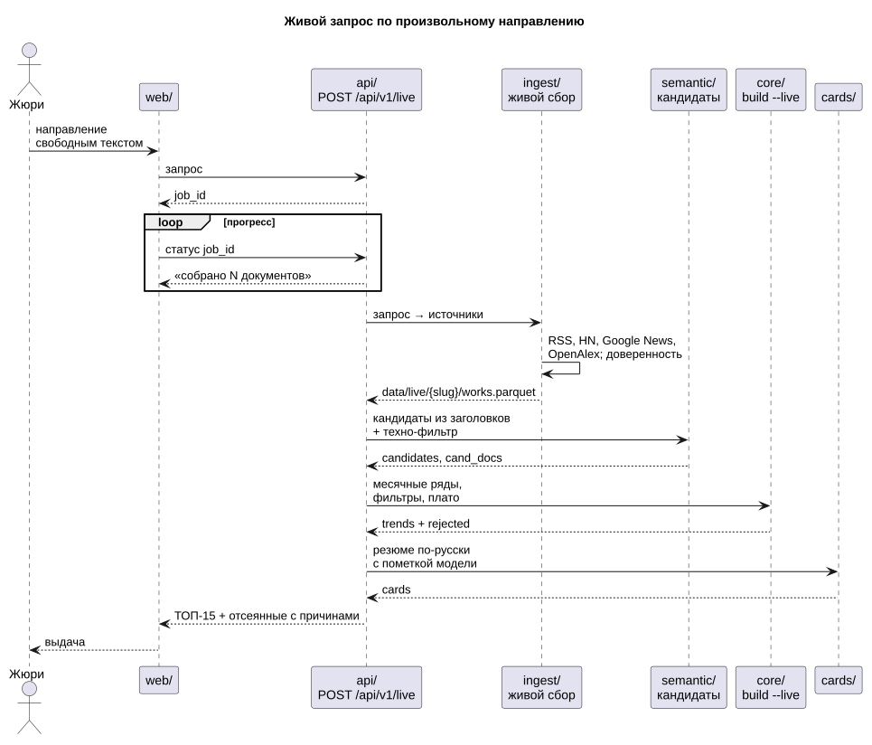

# Техническая документация

Краткое описание по разделу 5 ТЗ: пайплайн обработки данных, методология отбора
признаков, архитектура. Развёртывание — в [README](../README.md), полная
методология с формулами и литературой — в [01-methodology.md](01-methodology.md).

Схемы нарисованы в PlantUML, исходники и картинки — в [docs/diagrams/](diagrams/):

| Схема | Исходник | Что показывает |
|---|---|---|
| [Архитектура](#1-архитектура) | [architecture.puml](diagrams/architecture.puml) | компоненты и границы между ними |
| [Конвейер](#2-пайплайн-обработки-данных) | [pipeline.puml](diagrams/pipeline.puml) | обработка от сбора до выдачи |
| [Живой запрос](#25-живой-запрос) | [live.puml](diagrams/live.puml) | запрос по произвольному направлению |

Перерисовать после правки исходника: `make diagrams` (SVG и PNG рядом с `.puml`).

---

## 1. Архитектура



ТЗ требует «чёткое разделение логики парсинга, инференса модели и интерфейса».
У нас оно проведено не договорённостью, а устройством системы:

| Слой | Папки | Что делает | Что пишет |
|---|---|---|---|
| Парсинг | `ingest/` | сбор из открытых источников, нормализация, доверенность | `works.parquet` |
| Аналитика | `semantic/`, `core/`, `classifier/`, `cards/` | кандидаты, скоринг, фильтры, классификатор, карточки | `candidates`, `trends`, `rejected`, `cards` |
| Интерфейс | `api/`, `web/` | показывает готовое, **ничего не считает** | — |
| Хранилище | `storage/` | копия наборов в PostgreSQL | таблицы Postgres |

**Слои связаны файлами, а не вызовами.** Каждая стадия — отдельная CLI-команда:
читает parquet предыдущей и пишет свой. Формат каждого файла описан в
[contracts/schemas.py](../contracts/schemas.py) и проверяется в CI на каждом
пулл-реквесте. Отсюда три свойства, которые мы используем:

- любую стадию можно перезапустить отдельно, не трогая остальные;
- демо по индексу работает без сети — индекс это файлы;
- PostgreSQL получает схему из тех же контрактов (`storage/schema.py`), поэтому
  база и файлы не могут разойтись.

**Почему parquet для расчёта и Postgres для хранения.** Агрегация рядов по
6,3 млн документов в DuckDB поверх parquet занимает секунды без отдельного
сервера. Postgres, который ТЗ требует «для сырых данных и результатов», получает
каждый набор после расчёта: там документы и выдача лежат вместе и доступны
SQL-запросом аналитику. Замер: полный корпус грузится в базу за 3 мин 15 с.

## 2. Пайплайн обработки данных



```
ingest/    сбор          → data/corpus/{d}/works.parquet
semantic/  кандидаты     → data/index/{d}/candidates.parquet, cand_docs.parquet
core/      ряды, скоринг → data/index/{d}/trends.parquet, rejected.parquet
cards/     карточки      → data/index/{d}/cards.parquet
storage/   хранение      → PostgreSQL
api/ web/  выдача        ← читают data/index/
```

### 2.1. Сбор (`ingest/`)

Источники выбраны так, чтобы **не требовать ключей**: жюри разворачивает
решение без регистрации где-либо.

| Источник | Что даёт | Роль в модели |
|---|---|---|
| OpenAlex | 250+ млн научных работ, страны, организации, тип организации | ряды публикаций, география, доля корпоративных работ |
| arXiv | препринты — на 6–12 месяцев раньше журналов | ранний сигнал |
| RSS, Hacker News, Google News | новости и индустрия | живой режим |
| GitHub, Hugging Face | репозитории и модели | признаки зрелости (массовое внедрение) |

Патенты заменены корпоративными аффилиациями OpenAlex
(`authorships.institutions.type:company`): открытые патентные API требуют ключей,
а доля работ компаний — тот же сигнал коммерциализации.

Каждый документ несёт `url` (проверяемый первоисточник), дату, язык, тип
источника и **уровень доверенности**: `trusted` — рецензируемые публикации,
официальные источники; `indicator` — пресс-релизы, блоги, агрегаторы. По ТЗ
индикаторные источники не могут быть единственным основанием сигнала — это
проверяет фильтр живого режима (§4).

### 2.2. Кандидаты (`semantic/`)

Два генератора: **термины** — устойчивые n-граммы из заголовков и аннотаций —
и **кластеры** — тематические группы по эмбеддингам
`multilingual-e5-large` + UMAP + HDBSCAN. Связь «кандидат — документ» лежит
отдельной таблицей `cand_docs`, чтобы не раздувать кандидатов списками.

**Живой режим** добавляет третий генератор: локальная модель (Ollama,
`qwen2.5:7b`) читает до 300 свежих заголовков и **предлагает** названия
технологий (`semantic/llm_terms.py`). Кандидатом строка становится, только если
она дословно, целым словом, стоит в заголовках минимум двух документов, — связи
кандидат–документ строятся этим совпадением, а не ответом модели. Выдуманная
технология, которой нет в заголовках, отбрасывается автоматически. Зачем: правила
находят в основном названия компаний, и на широких запросах кандидатов было 1–7
(«финтех и платежи» — 2 из 617 документов). С моделью в тех же корпусах
появляются `stablecoin settlement`, `instant payments`, `physical ai`,
`ai data center`. Около 30 с на запрос; отказ модели не фатален.

### 2.3. Ряды и компоненты (`core/`)

Для каждого кандидата строится ряд: число документов по годам (индекс) или по
месяцам (живой режим, со сглаживанием по 3 месяцам).

**Peer-нормировка.** Частота делится не на весь корпус, а на активность пула
кандидатов. Причина измерена: OpenAlex индексирует свежие годы с задержкой, и
при делении на весь корпус все свежие темы выглядели бы растущими.

**Год взлёта вместо первого упоминания** — год, когда ряд вышел на 10%
собственного пика. Первое упоминание почти у любого термина уходит в 1990-е
случайными совпадениями и новизну не измеряет.

**Омонимы.** У `transformer` две жизни: электротехника и нейросети. Ряд
режется по разрывам (`core/homonym.py`), и оценивается текущий сегмент;
прорыв старого термина в новую жизнь ловит `core/breakout.py`. Тренд с
подозрением на тёзку не получает уверенность выше `medium`.

Пять компонент, каждая переводится в перцентильный ранг внутри пула:

| Компонента | Вес | Что меряет |
|---|---|---|
| novelty | 0,20 | молодость: лет с года взлёта |
| growth | 0,32 | наклон роста нормированной частоты |
| accel | 0,23 | ускорение: усилился ли рост в последние годы |
| burst | 0,15 | всплеск относительно базовой линии |
| diffusion | 0,10 | распространение: число стран (в живом режиме — сайтов) |

```
Emergence Score = Σ wᵢ · rankᵢ × (1 − 0,5 · maturity_pct)
```

`maturity_pct` — перцентиль частоты в пуле: самое массовое получает штраф
вдвое. Веса откалиброваны на бэктесте, менять их вручную нельзя: любое
изменение обязано улучшать Precision@15 на срезе 2021.

### 2.4. Карточки (`cards/`)

LLM (Ollama, локально) **только формулирует** текст по найденным документам:
проблема, преимущество, кейс, применимость для банка. Каждое утверждение несёт
`doc_id`; утверждение без источника выбрасывается на постобработке.
`citation_coverage` в карточке — доля утверждений с источником.

### 2.5. Живой запрос

Индекс покрывает заранее собранные направления. Направление, которого там нет,
обрабатывается живым запросом: сбор по новостям и OpenAlex за минуты, месячные
ряды вместо годовых, те же фильтры с порогами под новостной поток (§4).



## 3. Методология отбора признаков классификатора

ТЗ, этап 1: определять слабые сигналы на датасете заказчика с точностью
не ниже 75–80% и показывать, по каким признакам.

### 3.1. Выборка

100 слабых сигналов из датасета заказчика — положительный класс. Отрицательный
класс датасет не даёт, поэтому мы собрали **96 зрелых технологий** по тем же
шести областям, по 16 на область, у каждой — письменное обоснование зрелости
(`classifier/dataset.py`). Итог — 196 технологий, классы сбалансированы.

### 3.2. Правила отбора признака

Признак попадал в модель по трём обязательным условиям и проверялся четвёртым:

1. **Объясним одной фразой аналитику.** Каждый признак имеет текстовое
   описание, которое уходит в отчёт и интерфейс.
2. **Берётся из открытого источника без ключа.** Иначе жюри не воспроизведёт.
3. **Отказ источника не становится нулём.** Ошибка API — исключение
   `ОтказИсточника`, а не «ноль публикаций». Урок измерен: на первом прогоне
   441 из 1176 запросов вернули 429, записались нулями, и модель училась на
   дырах. Этот отчёт мы удалили, не закоммитив.
4. **Не ухудшает качество на кросс-валидации.** Проверяется абляцией: признак
   убирается, модель переобучается. Заметную потерю дают 8 признаков из 13
   (сильнее всего — звёзды GitHub и рост публикаций, по −3,5 п.п.). Остальные
   пять нейтральны и оставлены, потому что объясняют решение аналитику.
   Признаки, которые качество **ухудшали**, удалены (§3.4).

### 3.3. Признаки модели

| Группа | Признаки | Смысл |
|---|---|---|
| Рост науки | `pub_growth`, `pub_accel`, `pub_last_3y_share`, `pub_burst` | тема набирает обороты |
| Масштаб и возраст | `log_pub_total`, `pub_total_10y`, `pub_age` | насколько тема уже большая и давняя |
| Распространение | `pub_countries`, `pub_company_share` | география, выход в индустрию |
| Массовость внедрения | `github_repos`, `github_stars_max`, `github_new_share`, `hf_models` | уже массово внедрено = не слабый сигнал |

Направление влияния совпадает со смыслом: рост публикаций толкает к «сигналу»,
массовость на GitHub — к «зрелой технологии». Полная таблица весов — в
[classifier/REPORT.md](../classifier/REPORT.md).

### 3.4. Что отбросили и почему

**Новостные признаки Hacker News** — четыре признака (упоминания за год, доля
свежих, заголовки про раунды, громкость). Точность упала с 76% до 74%, а
направление оказалось обратным: у сигналов упоминаний меньше, чем у зрелых
(медиана 0 против 3). Поиск по фразе меряет известность названия, а не новизну.
Код сбора оставлен, в модель признаки не входят.

**Поиск точной фразы.** Запрос в кавычках давал ноль у 63 сигналов из 100:
`"AI agent IAM"` → 0, без кавычек → 136. Перешли на поиск по всем словам с
запасными формулировками (алиасами).

### 3.5. Модель и качество

Три модели на стратифицированной 5-fold кросс-валидации, повторённой на
20 случайных разбиениях; в таблице — среднее:

| Модель | Accuracy | Диапазон | Precision | Recall | F1 |
|---|---|---|---|---|---|
| Логистическая регрессия | 71% | 67–73% | 0,71 | 0,72 | 0,71 |
| Градиентный бустинг | 76% | 71–78% | 0,75 | 0,80 | 0,77 |
| **Случайный лес** | **77%** | **75–79%** | **0,75** | **0,83** | **0,79** |

Допустимый порог ТЗ 75% взят на всех 20 разбиениях, верхний 80% — нет.

**Почему 20 разбиений, а не одно.** Первая версия отчёта считала на одном
разбиении (seed 42) и показывала 79%. На двадцати это оказался максимум:
на 196 примерах результат одного разбиения гуляет на ±1–2 п.п. Одна удачная
цифра — именно то, что эксперт по аналитике справедливо поставит под сомнение. Выбор лучшей из трёх на той
же кросс-валидации даёт небольшой оптимистичный сдвиг — на новых данных
ожидаем чуть ниже.

**Где модель слепа.** Почти все ошибки — «сигнал принят за зрелую»:
нейроморфные чипы, аналоговые compute-in-memory чипы. Наука у них идёт
десятилетиями, а коммерческий сигнал новый. Публикационные признаки этого не
различают по построению — поэтому живой режим опирается на новости и индустрию.

Воспроизвести без сети: `uv run python -m classifier.train --offline`.

## 4. Фильтрация шума и зрелых технологий

Каждый отсеянный кандидат попадает в `rejected.parquet` **с причиной** — это
показывается в интерфейсе. Пороги найдены на реальных прогонах, каждый ловил
конкретный мусор.

| Фильтр | Индекс (годы) | Живой режим | Что ловит |
|---|---|---|---|
| Мало данных | < 20 док. | < 2 док.; < 4 — уверенность «низкая» | статистический шум |
| Слишком старый | > 8 лет с взлёта | > 24 мес. | давно известные темы |
| Всплеск одного периода | < 3 активных лет | < 3 мес. — уверенность «низкая» | разовая новость |
| Разовый вброс | > 80% в последнем году при < 10 стран | — (см. ниже) | пакетная заливка, маркетинговый вброс |
| Узкое распространение | < 5 стран | < 2 изданий | тема одной лаборатории или одного СМИ |
| Мейнстрим | верхний дециль частоты | > 10 000 научных работ за 10 лет в OpenAlex; плато > 18 мес. без роста | массово внедрённое, крупные компании, стандарты |
| Тема запроса | — | подпись совпадает с запросом | «quantum sensor» при запросе «квантовые сенсоры» |
| Индикаторные источники | — | < ⅓ доверенных | только пресс-релизы и блоги |
| Обрывок фразы | стоп-слово на краю, союз внутри | слово хроники на краю: «Holiday Robotics Raises», «First Pure-Play …» | куски заголовков вместо названий |

**Живой режим калиброван на реальных запросах (27.09).** Первая версия порогов
была выставлена без живых данных и на шести настоящих запросах дала ноль трендов.
Причины измерили: Google News отдаёт только свежие статьи, поэтому история
кандидата — один-два месяца, у молодой компании 2–6 упоминаний, а ссылка
агрегатора указывает на news.google.com вместо издания. Теперь издание берётся
из заголовка («… — Phys.org»), редкость и короткая история понижают уверенность,
но не прячут сигнал, а отсеивается только доказанно не-сигнал: массово изученное
(граница 10 000 работ по замеру на 82 кандидатах: выше — Google, Amazon, OpenAI,
`machine learning`; ниже — Q-CTRL, Mesa Quantum, Apptronik), сама тема запроса,
одно издание, одни пресс-релизы. Фильтр вброса по доле последнего месяца в живом
режиме снят: при свежей ленте новостей он отсекал бы всё.

Пример, ради которого фильтр вброса зависит от географии: на срезе 2021
`vision transformer` имел 14 стран и отсеивался бы как заливка, тогда как
у настоящей заливки (`lynching tree`, 1314 «публикаций» одного года) стран было
ноль. Разделяет их именно география.

**Почему в живом режиме плато, а не дециль.** В пуле из пяти тем «самая
частая» — как раз зарождающаяся. Мейнстрим по-новостному — это тема, о которой
давно и ровно пишут.

**Дедупликация.** Варианты одного термина (`vision transformer` /
`vision transformers`) склеиваются, только если сопоставимы по объёму (не более
чем в 3 раза) — иначе обрывок поглощал бы общий термин.

## 5. Отказоустойчивость парсеров

| Механизм | Где | Что даёт |
|---|---|---|
| Повторы с экспоненциальной паузой на 429 и 5xx, уважение `Retry-After` | `ingest/http.py` | переживаем лимиты и сбои API |
| Таймаут 45 с на запрос | `ingest/http.py` | зависший источник не вешает сбор |
| Отказ ≠ ноль | `classifier/features.py` | дыра в данных — ошибка, а не ложный признак |
| Кэш ответов на диске | `data/cache/` | повторный прогон бесплатный и мгновенный |
| Проверка контрактом до записи в базу | `storage/load.py` | битый файл не попадает в Postgres |
| Загрузка набора одной транзакцией | `storage/load.py` | в базе либо старая целая версия, либо новая |

## 6. Воспроизводимость и проверка качества

- **Золотой снапшот** `data/index/golden/` лежит в git: 5000 работ, тренды,
  карточки. Интерфейс и тесты работают на нём без сети.
- **Бэктест.** Считаем на данных до 2021 года и смотрим, что стало после:
  **93%** трендов выросли, медианная фора до пика — **6 лет**,
  `vision transformer` вырос в **65 раз**. Эталонный список собран до прогонов
  и не менялся по их результатам. Отчёт — [validation/REPORT.md](../validation/REPORT.md).
- **Отрицательный результат тоже записан.** Прогон на полном корпусе
  (6,3 млн работ) дал ТОП из обрывков заголовков — разбор в
  [validation/FULL_CORPUS_FINDINGS.md](../validation/FULL_CORPUS_FINDINGS.md).
- **CI на каждом пулл-реквесте:** ruff, 247 тестов, в том числе на настоящем
  Postgres, сборка фронтенда, проверка контрактов на золотом снапшоте, проверка
  зон ответственности.
